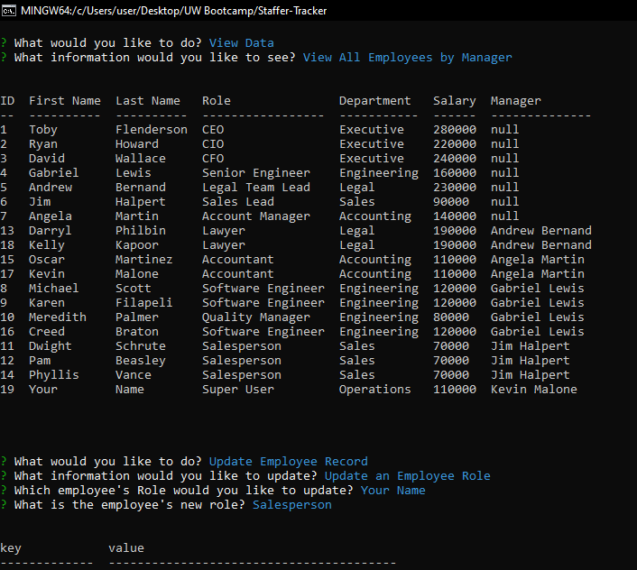

# Staffer Tracker - SQL

[](https://opensource.org/licenses/MIT)

## Table of Contents

1. [Description](#description)
2. [Installation](#installation)
3. [Usage](#usage)
4. [License](#license)
5. [Contributing](#contributing)
6. [User Story/Acceptance Criteria](#user-story-and-acceptance-criteria)
7. [Questions](#questions)

## Description

This project does not have a web-based deployment. Instead, this content management system (CMS) is deployed via the command line.

This application is a CMS that utilizing a SQL database to track staff members. It can be used to keep track of and report on member data, as well as providing a simple, easy to use interface for non-developers. This application will use an Express.js back end and will save and retrieve data from the SQL server database. 

### Mock Up

The screenshot below shows the deployed Command Line Interface.
[](./assets/mockup-demo.png)

### Task Completed
The task here was to complete a project that would allow the user to keep track of staff member data in a command line user interface. Autonomy is essential to become a proficient developer, and saving time by easily storing SQL data would aid in those efforts. This challenge should set myself up for future success by applying the core skills I've recently learned, meeting certain acceptance criteria with SQL and Server side APIs. The criteria are documented in the Acceptance Criteria section. 

## Installation

This project is deployed on the command line; a local installation must be used by downloading the repo. The application uses Express to incorperate my own API that I've created. <b>Once installed, the application is started with 'npm start' in the shell. </b>

## Usage

This project is meant to provide an easy solution to tracking team members or adding/removing them on the fly. It can save them, delete them, and add tags to better organize data in each member's SQL rows. It uses APIs to save the data to persist. 

## License

[](https://opensource.org/licenses/MIT)

This project is licensed under the MIT license.

## Contributing

To contribute to this repository, simply create a pull request, create issues, or reach out to me (see [Questions](#questions) below). I do my best to ensure that pull requests are up to date. 

## User Story and Acceptance Criteria

### User Story
```
AS A business owner
I WANT to be able to view and manage the departments, roles, and employees in my company
SO THAT I can organize and plan my business
```

### Acceptance Criteria
```
GIVEN a command-line application that accepts user input
WHEN I start the application
THEN I am presented with the following options: view all departments, view all roles, view all employees, add a department, add a role, add an employee, and update an employee role
WHEN I choose to view all departments
THEN I am presented with a formatted table showing department names and department ids
WHEN I choose to view all roles
THEN I am presented with the job title, role id, the department that role belongs to, and the salary for that role
WHEN I choose to view all employees
THEN I am presented with a formatted table showing employee data, including employee ids, first names, last names, job titles, departments, salaries, and managers that the employees report to
WHEN I choose to add a department
THEN I am prompted to enter the name of the department and that department is added to the database
WHEN I choose to add a role
THEN I am prompted to enter the name, salary, and department for the role and that role is added to the database
WHEN I choose to add an employee
THEN I am prompted to enter the employee’s first name, last name, role, and manager, and that employee is added to the database
WHEN I choose to update an employee role
THEN I am prompted to select an employee to update and their new role and this information is updated in the database
```

## Questions

If you have any questions, reach out to me through either of the methods below:
- [GitHub - J03B](https://github.com/J03B/)
- [email - (byucrazyfan@gmail.com)](mailto:byucrazyfan@gmail.com)
